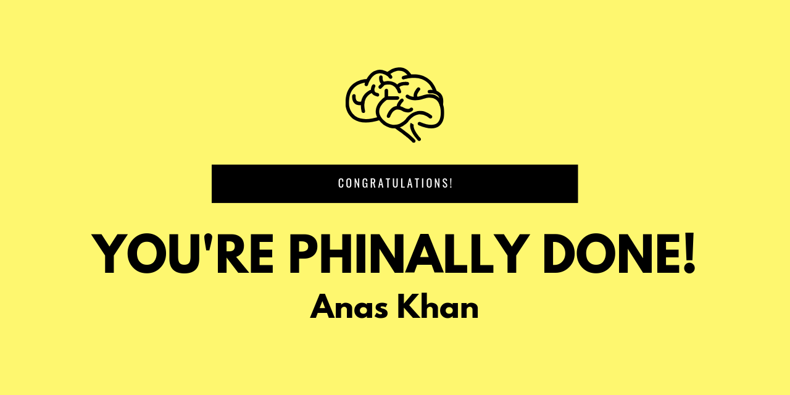

# E-Lab-Object-Oriented-Programming

# Contributing
All contributions are welcome. Just make a PR. Below is a list of general improvements that need to be added that I would love help with:
- Improve documentation
- Clean up code
- Update about new testcases
- Better algorithms that reduce time complexity
